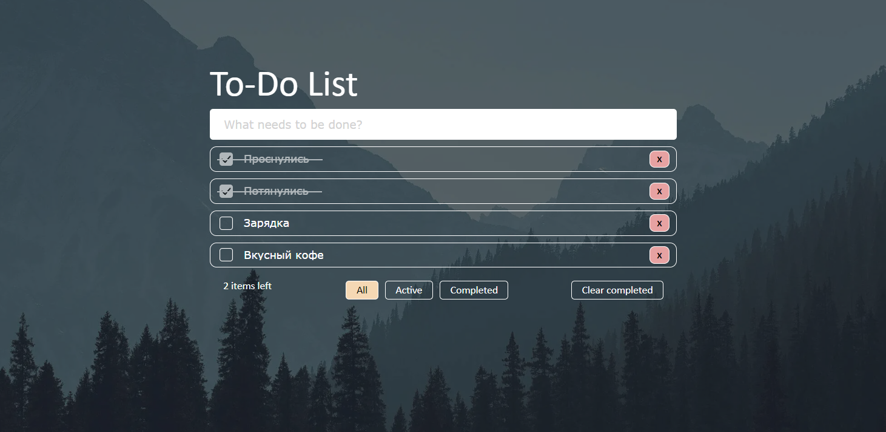

# <a id="top" />To-do app



---

### Оглавление

- [Описание](#description)
- [Как использовать](#how-to-use)
- [Ссылки](#references)
- [Автор проекта](#author)

---

## <a id="description" />Описание

Приложение "Список задач".

 * Выполнена адаптивная верстка интерфейсов приложения
 * Реализовано добавление, удаление задач
 * Реализован фильтр по трем параметрам (все, завершенные, активные)
 * Реализована очистка выполненных задач
 * Реализован счетчик активных задач
 * Реализовано сохранение задач в localStorage
 * DnD сортировка
 * Основной функционал покрыт E2E тестами Cypress.

Проект выложен на gh-pages (см. раздел ссылки)

#### Технологии

- React
- React Hooks
- TypeScript
- HTML
- CSS
- JS

[Наверх](#top)

---

## <a id="how-to-use" />Как использовать

#### Установка

```html
<p>npm i</p>
<p>npm run start</p>
```

[Наверх](#top)

---

## <a id="references" />Ссылки

Проект на [GH-Pages](https://andreikolosov.github.io/to-do-app/)

[Наверх](#top)

---

## <a id="author" />Автор

Андрей Колосов

- [Telegram](https://t.me/RustyVoid)

[Наверх](#top)
[Наверх](#top)
